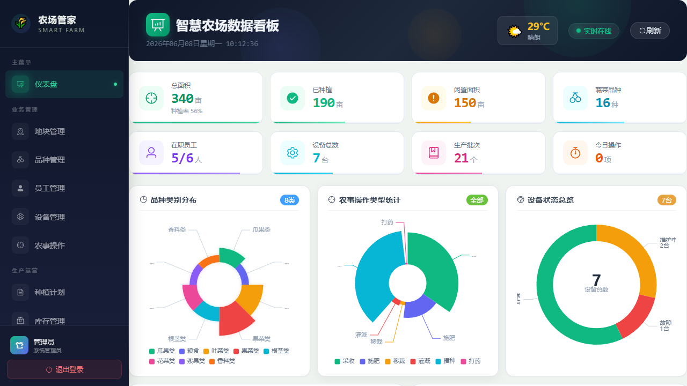
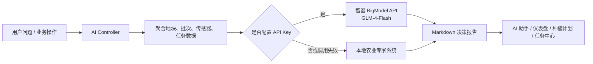
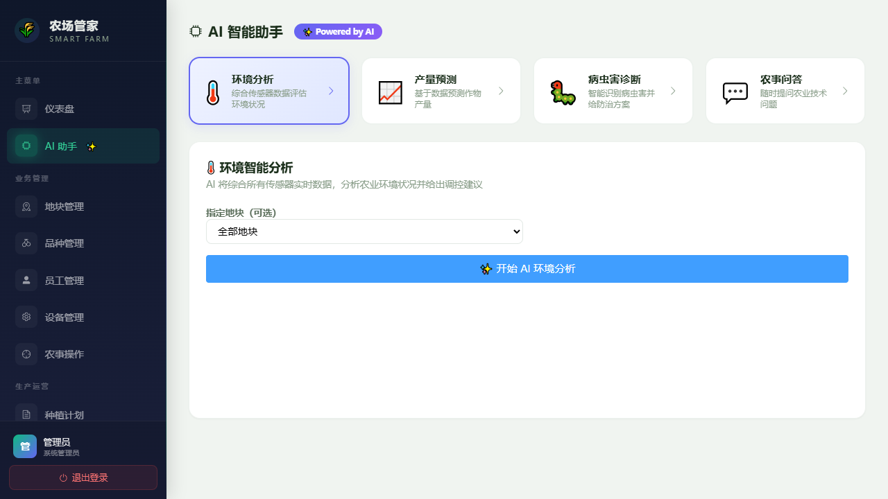
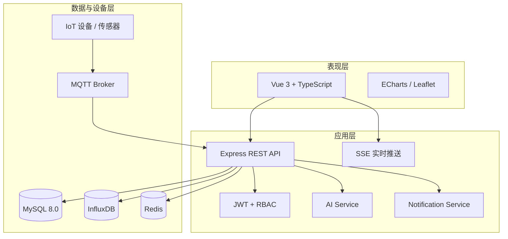

# 农场管家系统 · Smart Farm Manager

> 面向智慧农业生产全过程的数字化管理与 AI 决策平台

[](https://vuejs.org/)
[](https://www.typescriptlang.org/)
[](https://nodejs.org/)
[](https://www.mysql.com/)
[](https://open.bigmodel.cn/)
[](#功能完成情况)

## 项目概述

**项目简介：** 针对传统农场在地块、农事、设备、库存、成本与质量追溯之间数据割裂，环境异常发现滞后，以及经验难以转化为标准化决策等问题，项目构建了一套覆盖“种植前规划—生产中监测—采收后质检—库存销售—消费者追溯”的智慧农业管理平台。系统融合 MySQL 业务数据、IoT 传感器数据、MQTT 设备通信与大模型能力，为农场管理者提供可视化运营、实时预警和辅助决策支持。

**项目职责：** 围绕智慧农业实训目标，完成前后端分层架构、MySQL 数据模型、JWT + RBAC 权限体系、农事生产闭环、IoT 监测、质量追溯和经营分析等模块；基于智谱 GLM-4-Flash API 设计农业知识助手、环境分析、产量预测、病虫害诊断与智能排程功能，并通过 Work Buddy 与 Code Buddy 辅助需求梳理、规格化设计、代码审查、数据库迁移、测试验证和文档沉淀。

**项目成果：** 已完成 Phase 1–9 全部功能，形成 20 个页面视图、19 张实体数据表、100+ 个 REST/SSE 路由与 8 类 AI 能力；实现从传感器异常到任务提醒、从生产批次到质检追溯、从成本投入到销售利润的业务闭环。项目已完成前后端生产构建验证和 34 项自动化测试，可通过种子脚本快速恢复完整演示数据。



## 核心亮点

| 能力 | 工程实现 | 业务价值 |
|---|---|---|
| 全流程生产管理 | 地块、品种、计划、批次、农事、采收、质检统一建模 | 打通从播种到采收的生产链路 |
| AI 农业决策 | 大模型 API + 本地专家规则双模式 | 无 API Key 仍可运行，有 Key 时获得更强语义推理 |
| IoT 实时监测 | MQTT、六类传感器、异常检测、SSE 推送 | 快速发现高温、干旱、离线和死值等异常 |
| 质量安全追溯 | 追溯码、二维码、公开查询、质检快照、报告导出 | 面向消费者提供无需登录的可信生产档案 |
| 精细化经营 | 库存、盘点、成本、销售、利润、亩均指标 | 支撑经营复盘与生产决策 |
| 企业级安全 | JWT 双 Token、RBAC、限流、审计、参数校验 | 满足多角色协作与敏感操作留痕 |
| 多渠道通知 | 站内消息、浏览器、SMTP、企业微信、MQTT | 将告警和任务送达不同终端 |

## 大模型 API 与 AI 能力

系统不是简单地把聊天框接到模型上，而是先从 MySQL 与传感器数据中提取地块、作物、批次、环境、任务和人员信息，再通过专业农业 Prompt 组织上下文，调用大模型生成可执行建议。

### 双模式智能引擎



- **在线大模型模式：** 默认调用智谱开放平台兼容 Chat Completions 的接口，默认模型为 `glm-4-flash`。
- **本地降级模式：** 未配置密钥或远程请求失败时，自动使用内置品种知识库、24 节气知识、病虫害症状库、传感器阈值与环境评分规则。
- **安全策略：** API Key 仅由后端读取，不下发到浏览器，也不提交到 Git 仓库。
- **可替换模型：** `AI_BASE_URL`、`AI_API_KEY`、`AI_MODEL` 均可配置，可接入兼容相同请求格式的模型服务。

### 已实现的 8 类 AI 功能

| AI 能力 | 使用的数据上下文 | 输出内容 |
|---|---|---|
| 智能种植推荐 | 节气、空闲地块、土壤、品种、面积 | 品种选择、播期、密度、水肥方案与风险提示 |
| 环境智能分析 | 温湿度、土壤湿度、光照、CO₂、pH 与 24h 趋势 | 环境评分、异常定位和调控建议 |
| 产量预测 | 活跃批次、品种典型亩产、生长进度、环境修正因子 | 亩产与总产区间、影响因素和增产措施 |
| 病虫害诊断 | 症状、作物品种、地块环境 | 候选病虫害、置信度、防治药剂和预防措施 |
| 农事知识问答 | 用户问题与实时农场上下文 | 面向生产问题的专业 Markdown 答复 |
| 仪表盘智能洞察 | 农场概况、异常、批次和待办任务 | 每日状态摘要与优先事项 |
| 地块综合分析 | 指定地块、传感器、批次、操作和任务 | 地块健康评估与管理建议 |
| 智能任务排程 | 作物生长阶段、异常、人员和现有任务 | 按优先级生成周计划与执行人建议 |



### 模型配置

在 `backend/.env` 中配置：

```env
# 默认值为智谱 GLM-4-Flash，也可替换为兼容服务
AI_BASE_URL=https://open.bigmodel.cn/api/paas/v4/chat/completions
AI_API_KEY=your_api_key_here
AI_MODEL=glm-4-flash

# 兼容旧配置；AI_API_KEY 与 ZHIPU_API_KEY 二选一即可
ZHIPU_API_KEY=
```

后端调用格式：

```json
{
  "model": "glm-4-flash",
  "messages": [
    { "role": "system", "content": "农业专家系统提示词" },
    { "role": "user", "content": "业务数据与用户问题" }
  ],
  "temperature": 0.7,
  "max_tokens": 4096
}
```

## Work Buddy 与 Code Buddy 的使用

本项目将 AI 编程工具作为工程协作助手，而不是把未经验证的生成结果直接作为最终代码。

| 工具 | 参与阶段 | 主要工作 |
|---|---|---|
| **Work Buddy** | 前期分析与成果整理 | 项目需求梳理、代码规模分析、功能模块盘点、实训材料与汇报内容组织 |
| **Code Buddy** | 规格驱动开发 | 使用 Spec-Kit 完成需求、技术方案与任务拆解，辅助模块化实现和 Git 工作流 |
| **Code Buddy / Codex** | 系统审查与完善 | 将数据库统一迁移到 MySQL，修复配置与演示数据，补齐质量检验、公开追溯、多渠道通知、SSE 鉴权和异常去重，完成构建、测试与 README 重构 |

AI 辅助研发形成了“需求描述 → 规格与计划 → 代码实现 → 自动化测试 → 浏览器验收 → Git 提交”的闭环。所有关键修改均以实际代码、数据库结果和测试输出为准，避免文档与实现脱节。

## 系统架构



## 功能模块

### 生产与经营

- 地块、品种、员工和设备档案管理
- 种植计划、节气推荐、生产批次和生长周期跟踪
- 播种、施肥、灌溉、除草、打药、采收等农事记录
- 农资与农产品库存、出入库、盘点和库存预警
- 成本、销售、利润、亩均成本、产量预测与经营报表

### 物联网与智能决策

- 温度、湿度、土壤湿度、光照、CO₂、pH 六类传感器
- MQTT 数据接入与灌溉、通风、水泵等设备远程控制
- 量程越界、阈值超限、设备离线与传感器死值检测
- SSE 每 10 秒推送传感器数据、智能建议和未读通知
- AI 推荐、分析、预测、诊断、问答、洞察和排程

### 质量、安全与协作

- 批次完成、质量检验、品质分级和子批次拆分
- 追溯码、二维码、公开扫码页面和追溯报告导出
- 系统管理员、农艺师、操作员、只读观察者四级角色
- 站内、浏览器、邮件、企业微信与 MQTT 多渠道通知
- 登录限流、审计日志、敏感字段脱敏和参数校验

## 技术栈

| 层级 | 技术 |
|---|---|
| 前端 | Vue 3、TypeScript、Vite、Pinia、Vue Router、Element Plus、ECharts、Leaflet、Axios |
| 后端 | Node.js、Express、TypeScript、TypeORM、Joi、JWT、Winston |
| 数据 | MySQL 8.0、InfluxDB 2.7、Redis 7 |
| 物联网 | MQTT 5.0、Eclipse Mosquitto、SSE |
| AI | 智谱 BigModel API、GLM-4-Flash、本地农业专家系统、Prompt Engineering |
| 工程化 | Docker Compose、Jest、ts-jest、ESLint、Git、Spec-Kit |

## 快速开始

### 环境要求

- Node.js 18+
- MySQL 8.0+
- 可选：Redis、InfluxDB、Mosquitto、智谱 BigModel API Key

### 1. 克隆并创建数据库

```bash
git clone https://github.com/abc-nikc/Agri_005.git
cd Agri_005

mysql -u root -p
```

```sql
CREATE DATABASE farm_management
  CHARACTER SET utf8mb4
  COLLATE utf8mb4_unicode_ci;
```

### 2. 配置并启动后端

```bash
cd backend
npm ci
cp .env.example .env
npm run seed
npm run dev
```

Windows PowerShell 可使用 `Copy-Item .env.example .env`。执行 `npm run seed` 前，请先在 `.env` 中填写实际 MySQL 账号和密码。TypeORM 会在开发环境依据实体创建表结构，种子脚本可重复执行。

后端默认地址：`http://localhost:3001/api/v1`

### 3. 启动前端

```bash
cd frontend
npm ci
npm run dev
```

访问：`http://localhost:5173`

Windows 用户也可以在项目根目录运行：

```powershell
.\start-all.ps1
```

### 4. Docker 启动

```bash
docker compose up -d --build
```

Compose 会启动 MySQL、InfluxDB、Redis、Mosquitto、后端与前端。生产环境请替换默认密码、JWT 密钥和外部服务凭据。

## 核心环境变量

```env
# MySQL
DB_HOST=localhost
DB_PORT=3306
DB_USER=root
DB_PASSWORD=your_mysql_password
DB_NAME=farm_management
DB_SYNCHRONIZE=true

# JWT
JWT_SECRET=replace_with_a_strong_secret
REFRESH_TOKEN_SECRET=replace_with_another_strong_secret

# 大模型
AI_BASE_URL=https://open.bigmodel.cn/api/paas/v4/chat/completions
AI_API_KEY=
AI_MODEL=glm-4-flash

# 可选基础设施
REDIS_URL=redis://localhost:6379
INFLUX_URL=http://localhost:8086
MQTT_BROKER_URL=mqtt://localhost:1883

# 通知渠道：in_app,email,wechat,mqtt
NOTIFICATION_CHANNELS=in_app
```

完整配置见 [`backend/.env.example`](./backend/.env.example)。

## 默认演示账号

| 用户名 | 密码 | 角色 |
|---|---|---|
| `admin` | `admin123` | 系统管理员 |
| `liming` | `123456` | 农艺师 |
| `wangwu` | `123456` | 操作员 |
| `liuming` | `123456` | 只读观察者 |

> 默认账号仅用于本地演示，部署前必须修改密码。

## AI API 路由

所有接口位于 `/api/v1/ai`，并受 JWT 认证保护。

| 方法 | 路由 | 功能 |
|---|---|---|
| `POST` | `/planting-recommendation` | 智能种植推荐 |
| `GET` | `/environment-analysis` | 环境综合分析 |
| `POST` | `/yield-prediction` | 生产批次产量预测 |
| `POST` | `/pest-diagnosis` | 病虫害诊断 |
| `POST` | `/chat` | 农事知识问答 |
| `GET` | `/dashboard-insight` | 仪表盘经营洞察 |
| `GET` | `/plot-analysis` | 指定地块分析 |
| `GET` | `/smart-schedule` | 智能任务排程 |

## 项目结构

```text
Agri_005/
├── backend/
│   └── src/
│       ├── config/          # MySQL、Redis 等配置
│       ├── controllers/     # HTTP 控制器
│       ├── middlewares/     # 鉴权、限流、校验、审计
│       ├── models/          # TypeORM 实体模型
│       ├── routes/          # REST / SSE 路由
│       └── services/        # 业务、AI、MQTT、通知服务
├── frontend/
│   └── src/
│       ├── components/      # 通用组件
│       ├── composables/     # SSE、撤销等组合式逻辑
│       ├── services/        # API 客户端
│       ├── stores/          # Pinia 状态管理
│       └── views/           # 业务页面
├── scripts/                 # MySQL 初始化与演示数据脚本
├── specs/                   # 需求、设计、数据模型与接口契约
├── .codebuddy/              # Code Buddy / Spec-Kit 工作流
├── docker-compose.yml       # 完整运行环境
└── start-all.ps1            # Windows 一键启动
```

## 功能完成情况

- [x] Phase 1–3：认证授权、基础档案与可视化仪表盘
- [x] Phase 4：完整农事操作管理
- [x] Phase 5：生产批次、生长跟踪、产量预测与质量检验
- [x] Phase 6：农资/农产品库存、出入库和盘点
- [x] Phase 7：二维码追溯、公开查询与报告导出
- [x] Phase 8：成本、销售、利润和综合经营分析
- [x] Phase 9：站内、浏览器、邮件、企业微信与 MQTT 通知

## 构建与验证

```bash
# 后端
cd backend
npm run build
npm test -- --runInBand

# 前端
cd frontend
npm run build
```

当前基线：后端与前端构建通过，Jest 自动化测试 **34/34** 通过。

## 说明

- 本项目为智慧农业方向的团队实训项目。
- 邮件、企业微信、MQTT 和在线大模型调用需要部署方提供真实服务凭据。
- 仓库不保存 `.env`、API Key、数据库密码等敏感信息。
- 对外部署时应关闭 `DB_SYNCHRONIZE`，改用受控迁移流程，并替换所有默认账号与密钥。

---

如果这个项目对你有帮助，欢迎通过 [Issues](https://github.com/abc-nikc/Agri_005/issues) 提交建议。
