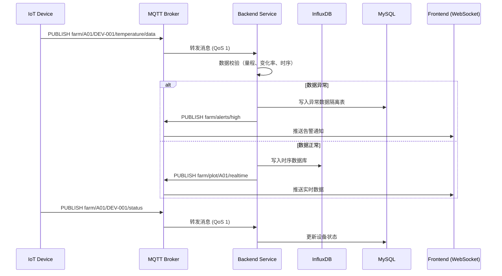
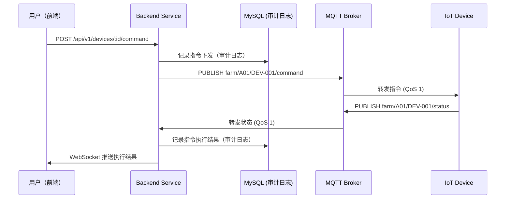

# MQTT Contracts: 农场管家系统

**Date**: 2026-05-28
**Feature**: 001-farm-management-system
**MQTT Broker**: `mqtt://mqtt.example.com:1883` (TLS: `mqtts://mqtt.example.com:8883`)

## Authentication

所有物联网设备使用 **一机一密** 认证方式。

**Username**: `device_{device_id}`
**Password**: 设备专属密钥（预配置在 Broker 中）

**TLS Configuration**:
- 必须使用 TLS 1.2+
- 设备端验证 Broker 证书（防止中间人攻击）

---

## Topic Structure

### 命名规范

```
farm/{plot_id}/{device_id}/{sensor_type}/data
farm/{plot_id}/{device_id}/command
farm/{plot_id}/{device_id}/status
```

**示例**:
- `farm/A01/DEV-TEMP-001/temperature/data` - A01地块温度传感器数据
- `farm/A01/DEV-PUMP-001/command` - A01地块水泵控制指令
- `farm/A01/DEV-PUMP-001/status` - A01地块水泵状态上报

---

## 1. 传感器数据上报 (Device → Broker → Backend)

### Topic: `farm/{plot_id}/{device_id}/{sensor_type}/data`

**QoS**: 1 (至少送达一次)
**Retain**: false

**Payload** (JSON format):
```json
{
  "device_id": "DEV-TEMP-001",
  "plot_id": "uuid-of-plot-A01",
  "sensor_type": "temperature",
  "value": 25.5,
  "unit": "°C",
  "timestamp": "2026-05-28T10:00:00Z",
  "battery_level": 85.0
}
```

**Field Descriptions**:

| Field | Type | Required | Description |
|-------|------|----------|-------------|
| `device_id` | string | ✅ | 设备唯一标识 |
| `plot_id` | string (UUID) | ✅ | 关联地块ID |
| `sensor_type` | string | ✅ | 传感器类型（见下表） |
| `value` | float | ✅ | 传感器数值 |
| `unit` | string | ✅ | 单位 |
| `timestamp` | string (ISO 8601) | ✅ | 采集时间 |
| `battery_level` | float | ❌ | 电池电量（%，可选） |

**Supported Sensor Types**:

| sensor_type | Description | Unit | Typical Range |
|-------------|-------------|------|---------------|
| `temperature` | 空气温度 | °C | -10 ~ 50 |
| `humidity` | 空气湿度 | % | 0 ~ 100 |
| `soil_moisture` | 土壤墒情 | % | 0 ~ 100 |
| `light` | 光照强度 | lux | 0 ~ 100000 |
| `soil_temperature` | 土壤温度 | °C | -10 ~ 40 |
| `co2` | CO2浓度 | ppm | 400 ~ 2000 |
| `ph` | 土壤pH值 | - | 0 ~ 14 |

---

## 2. 设备控制指令 (Backend → Broker → Device)

### Topic: `farm/{plot_id}/{device_id}/command`

**QoS**: 1
**Retain**: false

**Payload** (JSON format):
```json
{
  "command_id": "uuid",
  "device_id": "DEV-PUMP-001",
  "command_type": "irrigation",
  "action": "start",
  "parameters": {
    "duration": 30,
    "water_amount": 2000.0,
    "unit": "L"
  },
  "timestamp": "2026-05-28T10:05:00Z",
  "expire_at": "2026-05-28T10:10:00Z"
}
```

**Field Descriptions**:

| Field | Type | Required | Description |
|-------|------|----------|-------------|
| `command_id` | string (UUID) | ✅ | 指令唯一标识（用于追踪） |
| `device_id` | string | ✅ | 目标设备ID |
| `command_type` | string | ✅ | 指令类型（见下表） |
| `action` | string | ✅ | 操作（start/stop/set） |
| `parameters` | object | ❌ | 参数（根据指令类型变化） |
| `timestamp` | string (ISO 8601) | ✅ | 指令下发时间 |
| `expire_at` | string (ISO 8601) | ❌ | 指令过期时间 |

**Supported Command Types**:

| command_type | Description | Actions | Parameters |
|--------------|-------------|---------|-------------|
| `irrigation` | 灌溉控制 | start, stop | `duration` (分钟), `water_amount` (L) |
| `ventilation` | 通风控制 | start, stop | `fan_speed` (0-100%) |
| `lighting` | 补光控制 | start, stop, set | `intensity` (0-100%) |
| `fertilization` | 施肥控制 | start, stop | `amount` (kg), `dissolve_time` (分钟) |

---

## 3. 设备状态上报 (Device → Broker → Backend)

### Topic: `farm/{plot_id}/{device_id}/status`

**QoS**: 1
**Retain**: true (保留最后一条状态)

**Payload** (JSON format):
```json
{
  "device_id": "DEV-PUMP-001",
  "plot_id": "uuid-of-plot-A01",
  "status": "running",
  "last_command_id": "uuid|null",
  "last_command_result": "success|failed|timeout",
  "error_code": null,
  "timestamp": "2026-05-28T10:06:00Z"
}
```

**Field Descriptions**:

| Field | Type | Required | Description |
|-------|------|----------|-------------|
| `device_id` | string | ✅ | 设备唯一标识 |
| `plot_id` | string (UUID) | ✅ | 关联地块ID |
| `status` | string | ✅ | 设备状态（见下表） |
| `last_command_id` | string (UUID) | ❌ | 最后执行指令ID |
| `last_command_result` | string | ❌ | 指令执行结果 |
| `error_code` | string | ❌ | 错误码（如果失败） |
| `timestamp` | string (ISO 8601) | ✅ | 状态上报时间 |

**Device Status Values**:

| status | Description |
|--------|-------------|
| `idle` | 空闲（待命） |
| `running` | 运行中 |
| `maintenance` | 维护中 |
| `error` | 故障 |
| `offline` | 离线 |

---

## 4. 异常数据告警 (Backend → Broker → Frontend)

### Topic: `farm/alerts/{severity}`

**QoS**: 1
**Retain**: false

**Payload** (JSON format):
```json
{
  "alert_id": "uuid",
  "alert_type": "abnormal_data",
  "severity": "high",
  "device_id": "DEV-TEMP-001",
  "plot_id": "uuid-of-plot-A01",
  "message": "温度传感器DEV-TEMP-001检测到异常数据：温度=-99.9°C（超出量程）",
  "detected_at": "2026-05-28T10:00:05Z",
  "suggested_action": "请检查传感器连接是否正常，或联系技术支持。"
}
```

**Field Descriptions**:

| Field | Type | Required | Description |
|-------|------|----------|-------------|
| `alert_id` | string (UUID) | ✅ | 告警唯一标识 |
| `alert_type` | string | ✅ | 告警类型（见下表） |
| `severity` | string | ✅ | 严重程度（low/medium/high/critical） |
| `device_id` | string | ❌ | 关联设备ID（可选） |
| `plot_id` | string (UUID) | ❌ | 关联地块ID（可选） |
| `message` | string | ✅ | 告警消息 |
| `detected_at` | string (ISO 8601) | ✅ | 检测时间 |
| `suggested_action` | string | ❌ | 建议处理措施 |

**Alert Types**:

| alert_type | Description |
|------------|-------------|
| `abnormal_data` | 异常数据（量程越界、时间戳乱序等） |
| `device_offline` | 设备离线 |
| `low_battery` | 设备电池电量低 |
| `maintenance_due` | 设备维护到期 |
| `stock_low` | 库存低预警 |
| `expiry_warning` | 农资效期预警 |

---

## 5. 前端实时数据推送 (Backend → Broker → Frontend via WebSocket)

### WebSocket Endpoint: `wss://api.example.com/ws/realtime`

**Protocol**: MQTT over WebSocket

前端通过 WebSocket 订阅实时监控数据，无需直接连接 MQTT Broker。

**Subscription Topics**:
- `farm/plot/{plot_id}/realtime` - 地块实时数据
- `farm/alerts/{severity}` - 告警推送

**Message Format** (JSON):
```json
{
  "type": "sensor_data|alert|device_status",
  "payload": { ... }
}
```

**示例 - 实时传感器数据推送**:
```json
{
  "type": "sensor_data",
  "payload": {
    "plot_id": "uuid-of-plot-A01",
    "device_id": "DEV-TEMP-001",
    "sensor_type": "temperature",
    "value": 25.5,
    "unit": "°C",
    "timestamp": "2026-05-28T10:00:00Z"
  }
}
```

---

## 6. 后端订阅与处理逻辑

### 后端服务订阅的 Topics

| Topic | QoS | Purpose |
|-------|-----|---------|
| `farm/+/+/+/data` | 1 | 接收所有传感器数据 |
| `farm/+/+/status` | 1 | 接收所有设备状态上报 |
| `farm/alerts/+` | 1 | 接收告警（用于持久化到数据库） |

### 数据处理流程



---

## 7. 异常数据判定规则

后端在接收传感器数据时，执行以下校验规则：

| Rule | Description | Action if Violated |
|------|-------------|---------------------|
| 物理量程越界 | 数值超出传感器合理范围（如温度=-99°C） | 拒绝入库，写入隔离表，触发告警 |
| 时间戳乱序 | 数据时间戳早于最后一条记录 | 拒绝入库，写入隔离表 |
| 空值/零值异常 | 连续10个数据点全部为0或null | 拒绝入库，写入隔离表，触发告警 |
| 单点突变 | 与前后值偏差超过 3σ | 标记可疑，人工审核后可回补 |
| 长期无变化（死值） | 同一数值持续超过1小时 | 拒绝入库，写入隔离表，触发告警 |
| 设备离线检测 | 超过5分钟无数据上报 | 触发离线告警 |

**Configuration**:
- 所有阈值可在系统设置中配置
- 异常数据隔离表：`abnormal_sensor_data`
- 人工审核接口：`POST /api/v1/sensor-data/quarantine/:id/review`

---

## 8. 设备控制指令链路追踪

所有设备控制指令必须记录完整链路（审计合规）：



**Audit Log Entry**:
```json
{
  "user_id": "uuid",
  "action_type": "DEVICE_COMMAND",
  "action_params": {
    "device_id": "DEV-PUMP-001",
    "command_type": "irrigation",
    "action": "start",
    "parameters": { ... }
  },
  "result": "success",
  "created_at": "2026-05-28T10:05:00.123Z"
}
```

---

## 9. MQTT Broker 配置建议

### EMQX Broker 配置

```ini
# 认证配置
allow_anonymous = false
acl_nomatch = deny

# QoS 配置
mqtt.max_qos_allowed = 1

# 会话配置
zone.external.idle_timeout = 300s

# 消息大小限制
max_packet_size = 1MB

# TLS 配置
listeners.ssl.default.bind = 8883
listeners.ssl.default.certfile = /etc/emqx/certs/server.crt
listeners.ssl.default.keyfile = /etc/emqx/certs/server.key

# 保留消息限制
retainer.max_messages = 10000
```

### 设备访问控制 (ACL)

```json
{
  "DEVICE_001": {
    "publish": [
      "farm/+/DEVICE_001/+/data",
      "farm/+/DEVICE_001/status"
    ],
    "subscribe": [
      "farm/+/DEVICE_001/command"
    ]
  }
}
```

---

## 10. 错误码映射

| Error Code | Description | Action |
|------------|-------------|--------|
| `ERR_DEVICE_NOT_FOUND` | 设备不存在 | 检查 `device_id` 是否正确
| `ERR_PLOT_NOT_FOUND` | 地块不存在 | 检查 `plot_id` 是否正确
| `ERR_SENSOR_OFFLINE` | 传感器离线 | 检查设备电源和网络连接 |
| `ERR_ABNORMAL_DATA` | 异常数据 | 检查传感器是否故障 |
| `ERR_COMMAND_TIMEOUT` | 指令执行超时 | 重试或检查设备状态 |
| `ERR_INSUFFICIENT_PERMISSION` | 权限不足 | 检查用户角色和权限 |

---

## Summary

- **4 类 MQTT Topic** 已完整定义（数据上报、控制指令、状态上报、告警推送）
- **所有 Payload 格式** 已采用 JSON 规范
- **QoS 等级** 已明确（数据上报 QoS 1，控制指令 QoS 1）
- **异常处理规则** 已定义（异常数据拒绝入库、设备离线检测）
- **审计追踪** 已设计（指令链路完整记录）
- **安全认证** 已采用一机一密 + TLS 1.2+

下一步：创建 `quickstart.md`
