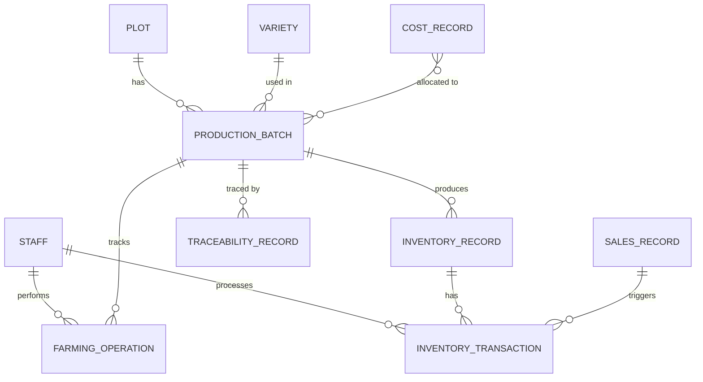

# Data Model: 农场管家系统

**Date**: 2026-05-28
**Feature**: 001-farm-management-system

## Entity Relationship Diagram (Conceptual)



## Entities & Attributes

### 1. 地块 (Plot)

**Description**: 农场土地的基本管理单元

**Table**: `plots`

| Field | Type | Constraints | Description |
|-------|------|-------------|-------------|
| id | UUID | PK | 唯一标识 |
| plot_number | VARCHAR(50) | UNIQUE, NOT NULL | 地块编号（如"A01"） |
| area | DECIMAL(10,2) | NOT NULL | 面积（亩） |
| current_variety_id | UUID | FK → varieties.id | 当前种植品种 |
| status | ENUM | NOT NULL | 状态：已种植/闲置 |
| soil_type | VARCHAR(50) | | 土壤类型 |
| region | VARCHAR(50) | NOT NULL | 所属区域（如"A区"） |
| created_at | TIMESTAMP | NOT NULL | 创建时间 |
| updated_at | TIMESTAMP | NOT NULL | 更新时间 |

**Validation Rules**:
- `area` > 0
- `plot_number` 唯一
- `status` 只能是 '已种植' 或 '闲置'

**State Transitions**: N/A (静态实体)

---

### 2. 品种 (Variety)

**Description**: 蔬菜品种信息及种植规范

**Table**: `varieties`

| Field | Type | Constraints | Description |
|-------|------|-------------|-------------|
| id | UUID | PK | 唯一标识 |
| name | VARCHAR(100) | UNIQUE, NOT NULL | 品种名称 |
| category | VARCHAR(50) | NOT NULL | 类别（如"茄果类"） |
| sowing_season | JSONB | | 播种季节配置（如["春季","秋季"]） |
| planting_density | INTEGER | | 种植密度（株/亩） |
| fertilization_rate | DECIMAL(10,2) | | 施肥量（kg/亩） |
| watering_frequency | INTEGER | | 浇水频率（天/次） |
| growth_cycle | INTEGER | | 生长周期（天） |
| safety_interval | INTEGER | | 安全间隔期（天） |
| is_active | BOOLEAN | DEFAULT true | 是否启用 |
| created_at | TIMESTAMP | NOT NULL | 创建时间 |
| updated_at | TIMESTAMP | NOT NULL | 更新时间 |

**Validation Rules**:
- `name` 唯一
- `planting_density` > 0 (if set)
- `fertilization_rate` > 0 (if set)

---

### 3. 人员 (Staff)

**Description**: 农场员工信息及权限

**Table**: `staff`

| Field | Type | Constraints | Description |
|-------|------|-------------|-------------|
| id | UUID | PK | 唯一标识 |
| name | VARCHAR(100) | NOT NULL | 姓名 |
| username | VARCHAR(50) | UNIQUE, NOT NULL | 登录用户名 |
| password_hash | VARCHAR(255) | NOT NULL | 密码哈希 |
| system_role | ENUM | NOT NULL | 系统角色：系统管理员/农艺师/操作员/只读观察者 |
| business_division | VARCHAR(50) | | 业务分工（田间作业/仓库管理/财务/销售等） |
| total_work_hours | DECIMAL(10,2) | DEFAULT 0 | 累计工时 |
| contact_phone | VARCHAR(20) | | 联系电话 |
| is_active | BOOLEAN | DEFAULT true | 是否在职 |
| last_login_at | TIMESTAMP | | 最后登录时间 |
| created_at | TIMESTAMP | NOT NULL | 创建时间 |
| updated_at | TIMESTAMP | NOT NULL | 更新时间 |

**Validation Rules**:
- `username` 唯一
- `system_role` 必须是有效角色
- `password_hash` 必须符合密码策略（最小8位，字母+数字）

**Indexes**:
- INDEX ON `staff` (`username`)
- INDEX ON `staff` (`system_role`)

---

### 4. 设备 (Equipment)

**Description**: 农机具和物联网设备信息

**Table**: `equipment`

| Field | Type | Constraints | Description |
|-------|------|-------------|-------------|
| id | UUID | PK | 唯一标识 |
| equipment_number | VARCHAR(50) | UNIQUE, NOT NULL | 设备编号 |
| type | ENUM | NOT NULL | 类型：农机具/灌溉设备/物联网设备 |
| status | ENUM | NOT NULL | 状态：正常/维护中/故障 |
| associated_plot_id | UUID | FK → plots.id | 关联地块 |
| next_maintenance_date | DATE | | 下次维护日期 |
| mqtt_topic | VARCHAR(255) | | MQTT主题（物联网设备） |
| created_at | TIMESTAMP | NOT NULL | 创建时间 |
| updated_at | TIMESTAMP | NOT NULL | 更新时间 |

**Validation Rules**:
- `equipment_number` 唯一
- `next_maintenance_date` > CURRENT_DATE (if set)

---

### 5. 种植计划 (Planting Plan)

**Description**: 种植安排

**Table**: `planting_plans`

| Field | Type | Constraints | Description |
|-------|------|-------------|-------------|
| id | UUID | PK | 唯一标识 |
| plot_id | UUID | FK → plots.id, NOT NULL | 关联地块 |
| variety_id | UUID | FK → varieties.id, NOT NULL | 关联品种 |
| planned_sowing_date | DATE | NOT NULL | 计划播种日期 |
| planned_harvest_date | DATE | | 计划采收日期 |
| standard_process_id | UUID | FK → planting_processes.id | 标准流程引用 |
| status | ENUM | NOT NULL | 状态：待执行/执行中/已完成/已调整 |
| adjustment_reason | TEXT | | 调整原因 |
| created_by | UUID | FK → staff.id, NOT NULL | 创建人 |
| created_at | TIMESTAMP | NOT NULL | 创建时间 |
| updated_at | TIMESTAMP | NOT NULL | 更新时间 |

**Validation Rules**:
- `planned_harvest_date` > `planned_sowing_date`
- `status` 只能是有效状态值

---

### 6. 生产批次 (Production Batch)

**Description**: 按"地块+品种+时间"生成的唯一生产单元

**Table**: `production_batches`

| Field | Type | Constraints | Description |
|-------|------|-------------|-------------|
| id | UUID | PK | 唯一标识 |
| batch_number | VARCHAR(50) | UNIQUE, NOT NULL | 批次号（如"P20260501-A01-番茄"） |
| plot_id | UUID | FK → plots.id, NOT NULL | 关联地块 |
| variety_id | UUID | FK → varieties.id, NOT NULL | 关联品种 |
| sowing_date | DATE | NOT NULL | 播种日期 |
| expected_harvest_date | DATE | | 预计采收日期 |
| status | ENUM | NOT NULL | 状态：进行中/已完成 |
| traceability_code | VARCHAR(100) | UNIQUE | 追溯码 |
| traceability_qr_path | VARCHAR(255) | | 二维码图片路径 |
| created_at | TIMESTAMP | NOT NULL | 创建时间 |
| updated_at | TIMESTAMP | NOT NULL | 更新时间 |

**Validation Rules**:
- `batch_number` 唯一
- `status` 只能是 '进行中' 或 '已完成'
- 状态为 '已完成' 时，不允许新增农事操作记录

**State Transitions**:
1. 首次农事操作提交 → 状态：进行中
2. 采收操作提交 → 状态：已完成（自动）
3. 已完成 → 不可切换回进行中

**Indexes**:
- INDEX ON `production_batches` (`batch_number`)
- INDEX ON `production_batches` (`plot_id`, `status`)
- INDEX ON `production_batches` (`traceability_code`)

---

### 7. 农事操作记录 (Farming Operation)

**Description**: 田间作业记录

**Table**: `farming_operations`

| Field | Type | Constraints | Description |
|-------|------|-------------|-------------|
| id | UUID | PK | 唯一标识 |
| operation_type | ENUM | NOT NULL | 操作类型：播种/施肥/打药/灌溉/除草/采收 |
| batch_id | UUID | FK → production_batches.id, NOT NULL | 关联批次 |
| plot_id | UUID | FK → plots.id, NOT NULL | 关联地块 |
| operator_id | UUID | FK → staff.id, NOT NULL | 操作人 |
| operation_date | DATE | NOT NULL | 操作日期 |
| operation_time | TIME | NOT NULL | 操作时间 |
| details | JSONB | NOT NULL | 操作详情（根据类型变化） |
| weather_condition | VARCHAR(100) | | 当时天气状况 |
| is_supplemental | BOOLEAN | DEFAULT false | 是否补录 |
| supplemental_timestamp | TIMESTAMP | | 补录时间 |
| created_at | TIMESTAMP | NOT NULL | 创建时间 |
| updated_at | TIMESTAMP | NOT NULL | 更新时间 |

**Operation Details Schema** (JSONB field `details`):

- **播种/移栽**:
  ```json
  {
    "variety": "番茄",
    "area": 5.0,
    "seed_source": "XX种子公司"
  }
  ```

- **施肥**:
  ```json
  {
    "fertilizer_type": "复合肥",
    "amount": 50.0,
    "unit": "kg"
  }
  ```

- **打药**:
  ```json
  {
    "pesticide_type": "吡虫啉",
    "amount": 100.0,
    "unit": "ml",
    "safety_interval_days": 7
  }
  ```

- **灌溉/排水**:
  ```json
  {
    "water_amount": 2000.0,
    "unit": "L",
    "duration": 30,
    "growth_stage": "开花期"
  }
  ```

- **除草/整枝**:
  ```json
  {
    "operation_content": "人工除草",
    "area": 5.0
  }
  ```

- **采收**:
  ```json
  {
    "yield_amount": 500.0,
    "unit": "kg",
    "quality_grade": "一级",
    "destination": "冷库"
  }
  ```

**Validation Rules**:
- `operation_type` 必须是有效类型
- `operator_id`, `batch_id`, `plot_id` 必填（四要素）
- 同一操作人 N 分钟内（默认5分钟）重复提交相同记录 → 拒绝
- 操作类型为 '打药' 且距采收不足安全间隔期 → 拒绝并强制预警
- 操作类型为 '采收' 且批次状态为 '已完成' → 拒绝

**Indexes**:
- INDEX ON `farming_operations` (`batch_id`, `operation_type`)
- INDEX ON `farming_operations` (`operator_id`, `operation_date`)
- INDEX ON `farming_operations` (`plot_id`, `operation_date`)

---

### 8. 库存记录 (Inventory Record)

**Description**: 物资库存信息

**Table**: `inventory_records`

| Field | Type | Constraints | Description |
|-------|------|-------------|-------------|
| id | UUID | PK | 唯一标识 |
| inventory_type | ENUM | NOT NULL | 物资类型：农产品/农资 |
| item_name | VARCHAR(100) | NOT NULL | 物资名称/品种名称 |
| specification | VARCHAR(100) | | 规格 |
| quantity | DECIMAL(10,2) | NOT NULL | 数量 |
| batch_id | UUID | FK → production_batches.id | 关联生产批次（农产品） |
| quality_grade | VARCHAR(20) | | 品质等级（农产品） |
| quality_check_result | ENUM | | 品质检测结果：合格/不合格 |
| storage_location | VARCHAR(100) | | 存放位置 |
| expiry_date | DATE | | 有效期（农资） |
| incoming_date | DATE | NOT NULL | 入库时间 |
| created_at | TIMESTAMP | NOT NULL | 创建时间 |
| updated_at | TIMESTAMP | NOT NULL | 更新时间 |

**Validation Rules**:
- `quantity` > 0
- `quality_check_result` 为 '不合格' 时，拒绝入库
- 农产品入库时，`quality_check_result` 必填

**Indexes**:
- INDEX ON `inventory_records` (`item_name`, `quality_grade`)
- INDEX ON `inventory_records` (`inventory_type`, `expiry_date`)

---

### 9. 出入库记录 (Inventory Transaction)

**Description**: 库存流水

**Table**: `inventory_transactions`

| Field | Type | Constraints | Description |
|-------|------|-------------|-------------|
| id | UUID | PK | 唯一标识 |
| transaction_type | ENUM | NOT NULL | 类型：入库/出库 |
| inventory_id | UUID | FK → inventory_records.id, NOT NULL | 关联库存 |
| quantity | DECIMAL(10,2) | NOT NULL | 数量 |
| operator_id | UUID | FK → staff.id, NOT NULL | 操作人 |
| approver_id | UUID | FK → staff.id | 审批人（出库时必填） |
| transaction_date | DATE | NOT NULL | 交易日期 |
| transaction_time | TIME | NOT NULL | 交易时间 |
| destination | VARCHAR(255) | | 去向/来源 |
| created_at | TIMESTAMP | NOT NULL | 创建时间 |
| updated_at | TIMESTAMP | NOT NULL | 更新时间 |

**Validation Rules**:
- `transaction_type` = '出库' 时：
  - `approver_id` 必填
  - `quantity` ≤ 当前库存数量
- `transaction_type` = '入库' 时：
  - `quantity` > 0
- FIFO原则：出库时优先扣减最早入库的批次

---

### 10. 盘点记录 (Stocktake Record)

**Description**: 盘点结果

**Table**: `stocktake_records`

| Field | Type | Constraints | Description |
|-------|------|-------------|-------------|
| id | UUID | PK | 唯一标识 |
| stocktake_type | ENUM | NOT NULL | 盘点类型：定期/循环 |
| executor_id | UUID | FK → staff.id, NOT NULL | 执行人（非操作员） |
| stocktake_date | DATE | NOT NULL | 盘点日期 |
| status | ENUM | NOT NULL | 状态：进行中/已完成 |
| variance_threshold | DECIMAL(5,2) | DEFAULT 2.00 | 误差率阈值（%） |
| created_at | TIMESTAMP | NOT NULL | 创建时间 |
| updated_at | TIMESTAMP | NOT NULL | 更新时间 |

**Validation Rules**:
- `executor_id` 不能是操作员（交叉盘点）
- 盘点期间暂停该库存项的出入库操作

**Child Table**: `stocktake_items` (盘点明细)

| Field | Type | Constraints | Description |
|-------|------|-------------|-------------|
| id | UUID | PK | 唯一标识 |
| stocktake_id | UUID | FK → stocktake_records.id, NOT NULL | 关联盘点 |
| inventory_id | UUID | FK → inventory_records.id, NOT NULL | 关联库存 |
| system_quantity | DECIMAL(10,2) | NOT NULL | 系统数量 |
| actual_quantity | DECIMAL(10,2) | NOT NULL | 实际数量 |
| variance_rate | DECIMAL(5,2) | | 误差率（%） |
| handling_result | VARCHAR(255) | | 处理结果 |

**Validation Rules**:
- `variance_rate` > `variance_threshold` → 启动盈亏处理流程

---

### 11. 追溯记录 (Traceability Record)

**Description**: 不可变的质量追溯数据聚合

**Table**: `traceability_records`

| Field | Type | Constraints | Description |
|-------|------|-------------|-------------|
| id | UUID | PK | 唯一标识 |
| batch_id | UUID | FK → production_batches.id, NOT NULL | 关联生产批次 |
| traceability_code | VARCHAR(100) | UNIQUE, NOT NULL | 追溯码 |
| seed_source | TEXT | | 种子来源 |
| farming_operations_summary | JSONB | | 农事操作汇总 |
| input_usage_summary | JSONB | | 投入品使用汇总 |
| environment_data_summary | JSONB | | 环境监控数据汇总 |
| harvest_info | JSONB | | 采收信息 |
| sales_info | JSONB | | 销售信息 |
| is_deleted | BOOLEAN | DEFAULT false | 是否删除（逻辑删除标记，实际不可删除） |
| created_at | TIMESTAMP | NOT NULL | 创建时间 |
| updated_at | TIMESTAMP | NOT NULL | 更新时间 |

**Critical Rules**:
- 追溯记录 **永久保存，不可删除、不可篡改**
- `is_deleted` 字段仅为合规保留，系统逻辑中忽略此字段
- 任何修改尝试 → 拒绝并记录审计日志

**Indexes**:
- INDEX ON `traceability_records` (`traceability_code`)
- INDEX ON `traceability_records` (`batch_id`)

---

### 12. 成本记录 (Cost Record)

**Description**: 成本核算数据

**Table**: `cost_records`

| Field | Type | Constraints | Description |
|-------|------|-------------|-------------|
| id | UUID | PK | 唯一标识 |
| plot_id | UUID | FK → plots.id | 关联地块（可选） |
| batch_id | UUID | FK → production_batches.id | 关联批次（可选） |
| cost_type | ENUM | NOT NULL | 成本类型：种子/肥料/农药/人工/机械/其他 |
| amount | DECIMAL(10,2) | NOT NULL | 金额（元） |
| occurrence_date | DATE | NOT NULL | 发生日期 |
| description | TEXT | | 描述 |
| created_by | UUID | FK → staff.id, NOT NULL | 创建人 |
| created_at | TIMESTAMP | NOT NULL | 创建时间 |
| updated_at | TIMESTAMP | NOT NULL | 更新时间 |

**Validation Rules**:
- `amount` > 0
- `plot_id` 和 `batch_id` 至少一个填写

---

### 13. 销售记录 (Sales Record)

**Description**: 销售订单信息

**Table**: `sales_records`

| Field | Type | Constraints | Description |
|-------|------|-------------|-------------|
| id | UUID | PK | 唯一标识 |
| customer_name | VARCHAR(100) | NOT NULL | 客户名称 |
| customer_contact | VARCHAR(100) | | 客户联系方式 |
| item_name | VARCHAR(100) | NOT NULL | 品种名称 |
| quantity | DECIMAL(10,2) | NOT NULL | 数量 |
| quality_grade | VARCHAR(20) | | 品质等级 |
| unit_price | DECIMAL(10,2) | NOT NULL | 单价（元） |
| total_amount | DECIMAL(10,2) | NOT NULL | 总金额（元） |
| sales_date | DATE | NOT NULL | 销售日期 |
| payment_status | ENUM | NOT NULL | 付款状态：未付款/部分付款/已付款 |
| handler_id | UUID | FK → staff.id, NOT NULL | 经手人 |
| created_at | TIMESTAMP | NOT NULL | 创建时间 |
| updated_at | TIMESTAMP | NOT NULL | 更新时间 |

**Validation Rules**:
- `quantity` > 0
- `unit_price` > 0
- `total_amount` = `quantity` * `unit_price`

---

## Time-Series Data Model (InfluxDB)

### Measurement: `sensor_data`

**Description**: 物联网传感器采集数据

**Tags** (indexed):
- `device_id` (STRING): 设备ID
- `plot_id` (STRING): 地块ID
- `sensor_type` (STRING): 传感器类型（temperature/humidity/soil_moisture/light）

**Fields** (values):
- `value` (FLOAT): 传感器数值
- `unit` (STRING): 单位
- `battery_level` (FLOAT, optional): 电池电量（%）

**Timestamp**: 
- `time` (RFC3339 timestamp): 采集时间

**Retention Policy**:
- `one_year`: 保留 365 天（原始数据，每30秒）
- `five_years`: 保留 1825 天（每小时聚合）
- `permanent`: 永久保留（每日聚合）

**Continuous Queries** (数据降采样):
```sql
-- 每小时聚合
CREATE CONTINUOUS QUERY "cq_hourly" ON "farm_management"
BEGIN
  SELECT mean("value") AS "mean_value"
  INTO "five_years"."sensor_data_hourly"
  FROM "one_year"."sensor_data"
  GROUP BY time(1h), "device_id", "plot_id", "sensor_type"
END

-- 每日聚合
CREATE CONTINUOUS QUERY "cq_daily" ON "farm_management"
BEGIN
  SELECT mean("value") AS "mean_value"
  INTO "permanent"."sensor_data_daily"
  FROM "five_years"."sensor_data_hourly"
  GROUP BY time(1d), "device_id", "plot_id", "sensor_type"
END
```

---

## Audit Log Model

### Table: `audit_logs`

**Description**: 所有关键操作的审计日志

| Field | Type | Constraints | Description |
|-------|------|-------------|-------------|
| id | UUID | PK | 唯一标识 |
| user_id | UUID | FK → staff.id | 操作者ID |
| user_ip | INET | | 操作者IP地址 |
| action_type | VARCHAR(100) | NOT NULL | 操作类型 |
| action_params | JSONB | | 操作参数 |
| target_entity | VARCHAR(100) | | 目标实体 |
| target_id | UUID | | 目标实体ID |
| before_state | JSONB | | 操作前状态 |
| after_state | JSONB | | 操作后状态 |
| result | ENUM | NOT NULL | 结果：成功/失败/异常 |
| error_message | TEXT | | 错误信息 |
| created_at | TIMESTAMP | NOT NULL | 操作时间（毫秒精度） |

**Critical Rules**:
- 审计日志 **不可删除、不可篡改**
- 查询 API 支持按时间范围、操作者、操作类型筛选

**Indexes**:
- INDEX ON `audit_logs` (`user_id`, `created_at`)
- INDEX ON `audit_logs` (`action_type`, `created_at`)

---

## System Settings Model

### Table: `system_settings`

**Description**: 系统配置参数（可配置阈值）

| Field | Type | Constraints | Description |
|-------|------|-------------|-------------|
| id | UUID | PK | 唯一标识 |
| setting_key | VARCHAR(100) | UNIQUE, NOT NULL | 配置键 |
| setting_value | TEXT | NOT NULL | 配置值 |
| value_type | ENUM | NOT NULL | 值类型：integer/float/string/boolean |
| description | TEXT | | 描述 |
| is_editable | BOOLEAN | DEFAULT true | 是否可编辑 |
| updated_by | UUID | FK → staff.id | 修改人 |
| created_at | TIMESTAMP | NOT NULL | 创建时间 |
| updated_at | TIMESTAMP | NOT NULL | 更新时间 |

**Default Settings** (预置默认值):
| setting_key | setting_value | value_type | description |
|-------------|---------------|------------|-------------|
| `duplicate_submit_interval` | `5` | integer | 重复提交间隔（分钟） |
| `stocktake_variance_threshold` | `2.0` | float | 盘点误差率阈值（%） |
| `expiry_alert_days` | `30` | integer | 效期预警提前天数 |
| `low_stock_threshold` | `100` | integer | 低库存预警阈值（可分级配置） |
| `maintenance_alert_days` | `3` | integer | 设备维护提前提醒天数 |

---

## Relationships & Foreign Keys

```sql
-- Plot relationships
ALTER TABLE plots 
  ADD CONSTRAINT fk_plots_variety 
  FOREIGN KEY (current_variety_id) REFERENCES varieties(id);

-- Planting Plan relationships
ALTER TABLE planting_plans 
  ADD CONSTRAINT fk_planting_plans_plot 
  FOREIGN KEY (plot_id) REFERENCES plots(id),
  ADD CONSTRAINT fk_planting_plans_variety 
  FOREIGN KEY (variety_id) REFERENCES varieties(id),
  ADD CONSTRAINT fk_planting_plans_creator 
  FOREIGN KEY (created_by) REFERENCES staff(id);

-- Production Batch relationships
ALTER TABLE production_batches 
  ADD CONSTRAINT fk_production_batches_plot 
  FOREIGN KEY (plot_id) REFERENCES plots(id),
  ADD CONSTRAINT fk_production_batches_variety 
  FOREIGN KEY (variety_id) REFERENCES varieties(id);

-- Farming Operation relationships
ALTER TABLE farming_operations 
  ADD CONSTRAINT fk_farming_operations_batch 
  FOREIGN KEY (batch_id) REFERENCES production_batches(id),
  ADD CONSTRAINT fk_farming_operations_plot 
  FOREIGN KEY (plot_id) REFERENCES plots(id),
  ADD CONSTRAINT fk_farming_operations_operator 
  FOREIGN KEY (operator_id) REFERENCES staff(id);

-- Inventory relationships
ALTER TABLE inventory_records 
  ADD CONSTRAINT fk_inventory_records_batch 
  FOREIGN KEY (batch_id) REFERENCES production_batches(id);

-- Inventory Transaction relationships
ALTER TABLE inventory_transactions 
  ADD CONSTRAINT fk_inventory_transactions_inventory 
  FOREIGN KEY (inventory_id) REFERENCES inventory_records(id),
  ADD CONSTRAINT fk_inventory_transactions_operator 
  FOREIGN KEY (operator_id) REFERENCES staff(id),
  ADD CONSTRAINT fk_inventory_transactions_approver 
  FOREIGN KEY (approver_id) REFERENCES staff(id);

-- Stocktake relationships
ALTER TABLE stocktake_records 
  ADD CONSTRAINT fk_stocktake_records_executor 
  FOREIGN KEY (executor_id) REFERENCES staff(id);

ALTER TABLE stocktake_items 
  ADD CONSTRAINT fk_stocktake_items_stocktake 
  FOREIGN KEY (stocktake_id) REFERENCES stocktake_records(id),
  ADD CONSTRAINT fk_stocktake_items_inventory 
  FOREIGN KEY (inventory_id) REFERENCES inventory_records(id);

-- Traceability relationships
ALTER TABLE traceability_records 
  ADD CONSTRAINT fk_traceability_records_batch 
  FOREIGN KEY (batch_id) REFERENCES production_batches(id);

-- Cost relationships
ALTER TABLE cost_records 
  ADD CONSTRAINT fk_cost_records_plot 
  FOREIGN KEY (plot_id) REFERENCES plots(id),
  ADD CONSTRAINT fk_cost_records_batch 
  FOREIGN KEY (batch_id) REFERENCES production_batches(id),
  ADD CONSTRAINT fk_cost_records_creator 
  FOREIGN KEY (created_by) REFERENCES staff(id);

-- Sales relationships
ALTER TABLE sales_records 
  ADD CONSTRAINT fk_sales_records_handler 
  FOREIGN KEY (handler_id) REFERENCES staff(id);

-- Audit Log relationships
ALTER TABLE audit_logs 
  ADD CONSTRAINT fk_audit_logs_user 
  FOREIGN KEY (user_id) REFERENCES staff(id);
```

---

## Indexes for Performance

```sql
-- Plots
CREATE INDEX idx_plots_region ON plots(region);
CREATE INDEX idx_plots_status ON plots(status);

-- Production Batches
CREATE INDEX idx_production_batches_status ON production_batches(status);
CREATE INDEX idx_production_batches_sowing_date ON production_batches(sowing_date);

-- Farming Operations
CREATE INDEX idx_farming_operations_date ON farming_operations(operation_date);
CREATE INDEX idx_farming_operations_type ON farming_operations(operation_type);

-- Inventory
CREATE INDEX idx_inventory_records_type ON inventory_records(inventory_type);
CREATE INDEX idx_inventory_records_expiry ON inventory_records(expiry_date) 
  WHERE expiry_date IS NOT NULL;

-- Sales
CREATE INDEX idx_sales_records_date ON sales_records(sales_date);
CREATE INDEX idx_sales_records_payment ON sales_records(payment_status);

-- Audit Logs (critical for query performance)
CREATE INDEX idx_audit_logs_created_at ON audit_logs(created_at DESC);
CREATE INDEX idx_audit_logs_user_action ON audit_logs(user_id, action_type);
```

---

## Data Integrity Constraints

```sql
-- Ensure plot cannot have multiple active batches
CREATE UNIQUE INDEX idx_unique_active_batch 
  ON production_batches(plot_id) 
  WHERE status = '进行中';

-- Ensure duplicate submission prevention (application-level check)
-- This requires checking recent records within N minutes (configurable)
-- Implemented in service layer, not database constraint

-- Ensure inventory quantity cannot go negative
CREATE CONSTRAINT ck_inventory_quantity_positive 
  CHECK (quantity >= 0);

-- Ensure cost amount is positive
CREATE CONSTRAINT ck_cost_amount_positive 
  CHECK (amount > 0);

-- Ensure valid date ranges
CREATE CONSTRAINT ck_planting_dates 
  CHECK (planned_harvest_date IS NULL OR planned_harvest_date > planned_sowing_date);
```

---

## Summary

- **13 个核心实体** 已完整定义
- **所有验证规则** 已从功能需求中提取并映射到字段约束
- **状态转换规则** 已定义（生产批次）
- **时序数据模型** (InfluxDB) 已设计
- **审计日志模型** 已设计（不可篡改）
- **系统配置模型** 已设计（可配置阈值）
- **外键关系** 已定义
- **性能索引** 已规划

下一步：创建接口契约文档 (`contracts/`)
